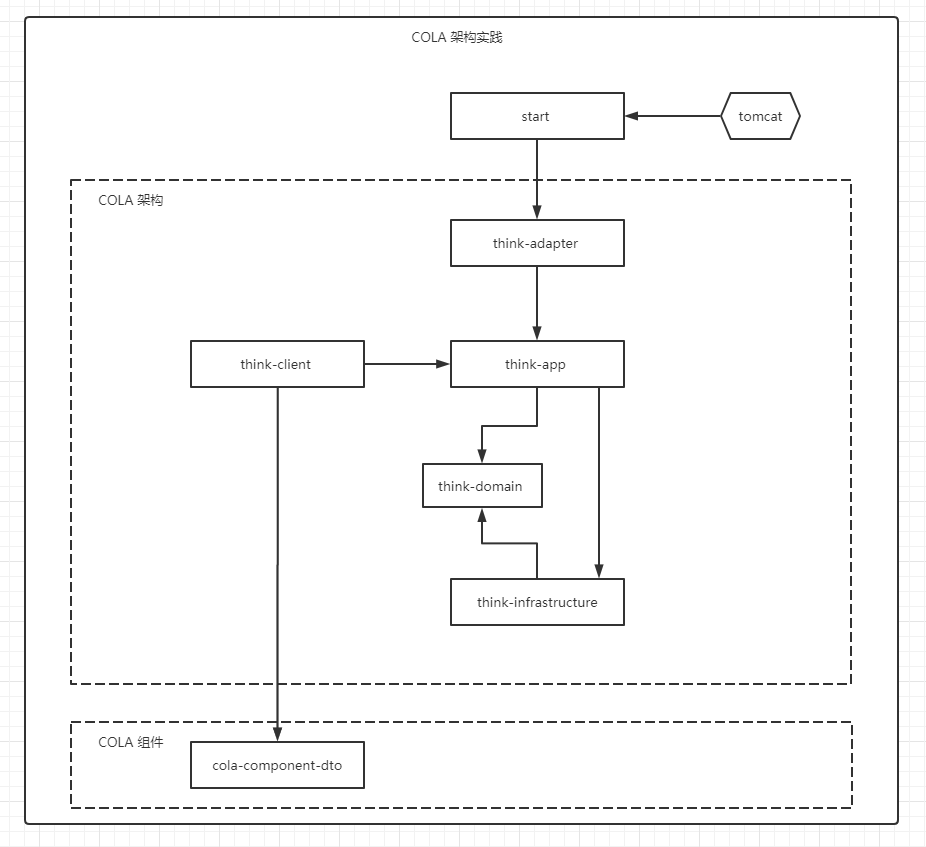

# Think

> Think about architecture and use CLOA as a template

```shell
mvn archetype:generate  -DgroupId=com.amos -DartifactId=think -Dversion=1.0.0-SNAPSHOT -Dpackage=com.amos.think -DarchetypeArtifactId=cola-framework-archetype-web -DarchetypeGroupId=com.alibaba.cola -DarchetypeVersion=4.0.0
```

## 项目架构图



## 参考

- [https://github.com/alibaba/COLA](https://github.com/alibaba/COLA)

- [COLA 4.0：应用架构的最佳实践](https://blog.csdn.net/significantfrank/article/details/110934799)