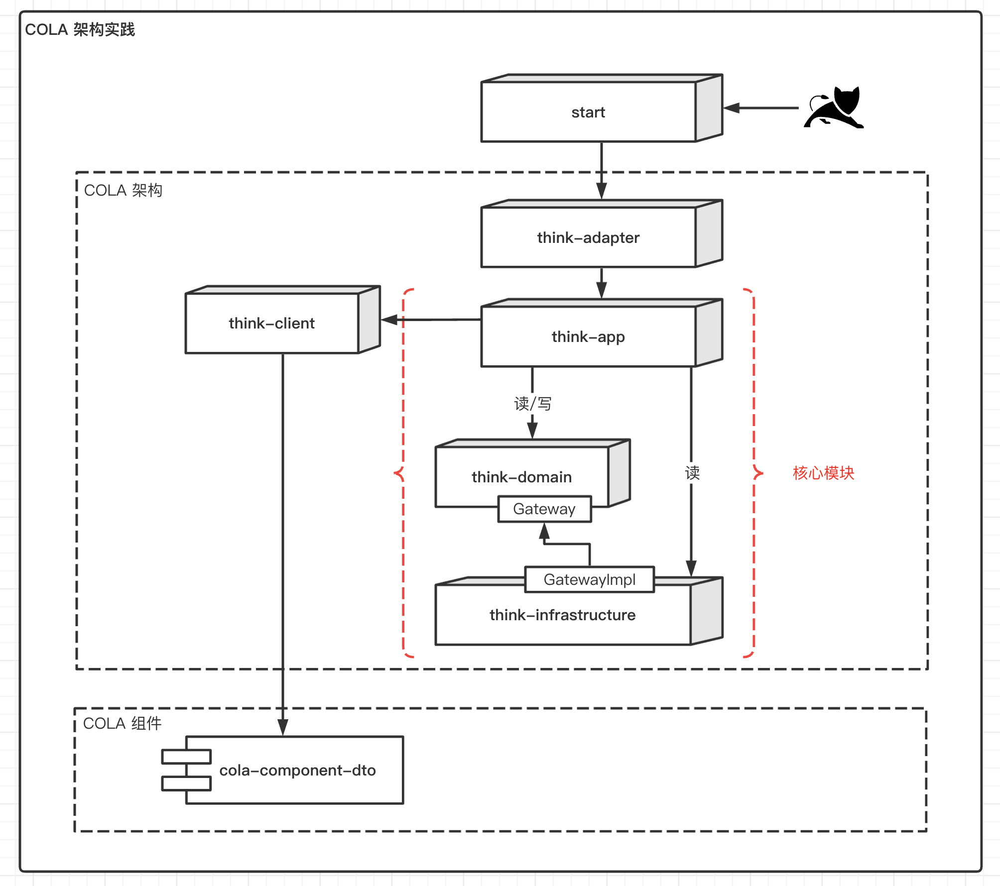
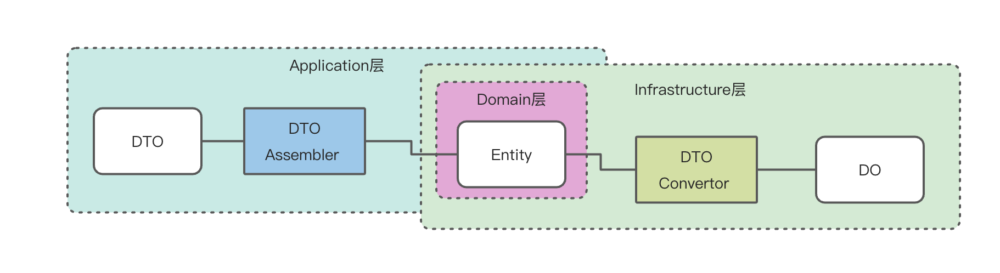
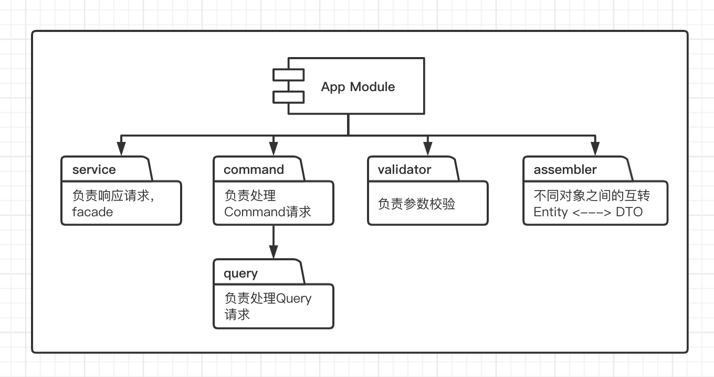

# Think

> 工程师的首要技术使命就是控制复杂度，本项目结合COLA 4.0（整洁面向对象分层架构）实现。

## 使用 Maven archetype 创建项目

```shell
mvn archetype:generate  -DgroupId=com.amos -DartifactId=think -Dversion=1.0.0-SNAPSHOT -Dpackage=com.amos.think -DarchetypeArtifactId=cola-framework-archetype-web -DarchetypeGroupId=com.alibaba.cola -DarchetypeVersion=4.0.0
```

## 项目架构图



## 项目案例

用户注册、登录、修改、查询用户 && 用户列表；

数据库采用内存数据库`h2database`，也即无需准备数据库环境。

## 项目重构指北

重构项目时，可以先把模块下的包建好，然后把之前项目的代码迁到指定包。最后，按业务线连起来，调试、跑通。

实践的时候走了不少弯路，建议把作者写的 5 篇博客看一遍（链接放文末了）

## 个人想法

> 可能有错，欢迎Issue，谢谢

- 不要把领域对象和数据库中的存的xxxDO混为一谈；想一下，领域对象要 ~~创建人、修改人、~~ 逻辑删除标识有啥用？
- 一开始不要过度设计，需求增加的过程中，更能看清项目未来的方向；另外，不要把重构一直往后拖，越早重构越可控；
- xxxDTO 什么时候用呢，DTO 是不是完全可以用 xxxCO、xxxVO 等代替？

## COLA 规范

> 含有部分个人习惯

|规范|用途|解释|
|---|---|---|
|xxxCO| Client Object | 客户对象，用于传输数据，等同于DTO |
|xxxCmd| Client Request | Cmd代表Command，表示一个写请求 |
|xxxQuery| Client Request | Query，表示一个读请求 |
|xxxCmdExe| Command Executor | 命令模式，每一个写请求对应一个执行器 |
|xxxQueryExe| Query Executor | 命令模式，每一个读请求对应一个执行器 |
|xxxVO| Value Object | 值对象 |
|xxxEntity| Entity | 领域实体 |
|xxxDO| Data Object | 数据对象，用于持久化 |
|xxxInterceptor| Command Interceptor | 拦截器，用于处理切面逻辑 |
|IxxxService| API Service | xxxServiceI 不太习惯，就把 I 放在前边吧 |
|xxxDomainService| Domain Service | 需要多个领域对象协作时，使用DomainService |
|xxxValidator| Validator | 校验器，用于校验的类 |
|xxxAssembler| Assembler | 组装器，DTO <---> Entity，用于Application层 |
|xxxConvertor| Convertor | 转化器，Entity <---> DO，用于Infrastructure层 [小彩蛋](./doc/README.md#Convertor)） |

- Application：对外暴露的是DTO，不能暴露 Entity
- Domain：gateway对外暴露的是Entity，不能暴露 DO
- 所以这里有两套转换器 xxxAssembler 和 xxxConvertor
  

### 方法名约定

|CRUD操作| 方法名约定 |
|---|---|
|新增| create |
|添加| add |
|删除| remove（App和Domain层），delete（Infrastructure层） |
|修改| update |
|查询（单个结果） | get |
|查询（多个结果） | list |
|分页查询| page |
|统计| count |

### 模块规范

> 没有银弹，仅做参考，按需取舍吧




### 《代码精进之路》摘录

> 要记住，留给公司一个方便维护、整洁优雅的代码库，是我们技术人员最高技术使命，也是我们对公司做出的最大技术贡献。

- 【日志规范】能用debug就不要用info，能用warn就不要用error。滥用的error与狼来了无疑；
- 【方法参数要少】参数越少，越容易理解，也便于测试，各个参数的组合就如笛卡尔积；
- 【空行规范】方法、逻辑分段，要加空行，提高代码可读性。车轮毂与车轴之间有空隙，车才能跑；书法绘画有留白；
- 【防止破窗】首先我们要有一套规范，并尽量遵守规范，不要做“打破第一扇窗”的人；其次，发现“破窗”要及时修复，不要让问题进一步恶化；
- 【三次原则】第一次用到某功能时，写一个特定的解决方法；第二次又用到时，复制上一次的代码；第三次出现时，就要着手写通用解决方案了；
- 【最小惊奇原则】写代码不是写侦探小说，要的是简单易懂，而不是时不时搞点烧脑的骚操作；
- 【请求读写分离】增删改，会改变对象的状态，只需返回成功失败即可；查询是不会改变对象状态的，对系统没副作用。

## 参考

- [https://github.com/alibaba/COLA](https://github.com/alibaba/COLA)

- [复杂度应对之道 - COLA应用架构](https://blog.csdn.net/significantfrank/article/details/85785565)
- [应用架构COLA 2.0](https://blog.csdn.net/significantfrank/article/details/100074716)
- [应用架构COLA3.0：让事情回归简单](https://blog.csdn.net/significantfrank/article/details/106976804)
- [应用架构COLA 3.1：分类思维](https://blog.csdn.net/significantfrank/article/details/109529311)
- [COLA 4.0：应用架构的最佳实践](https://blog.csdn.net/significantfrank/article/details/110934799)

- 张建飞著. 代码精进之路：从码农到工匠[M].北京：人民邮电出版社，2020.1
