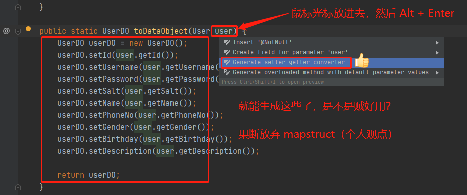

# think

> 天下功夫，唯快不破

## 技术栈

- Spring | JPA | MyBatis
- JPA 做自动建表、基础增删改查
- MyBatis 做复杂查询

## 小技巧

### Convertor

> 对象互转

- **安装 IDEA 插件**

  <kbd>Preferences(Settings)</kbd> > <kbd>Plugins</kbd> > <kbd>Browse repositories...</kbd> >
  <kbd>find"GenerateAllSetter"</kbd> > <kbd>Install Plugin</kbd>

- **体验一把**
  

---
